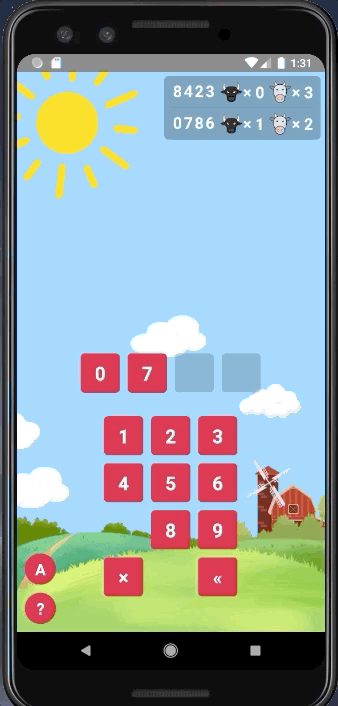

# Bulls and Cows
A fun game made with React-Native.

## Rules
- The AI thinks of a number, while the player tries to guess it.
- The number to be guessed must be a 4 digit number, using digits from 0 to 9, each digit at most once. e.g. 1234 is valid, but 1233 is not valid.
- For every guess that the player makes, he gets 2 values - the number of bulls and the number of cows. 1 bull means the guess contains and the target number have 1 digit in common, and in the correct position. 1 cow means the guess and the target have 1 digit in common, but not in correct position. e.g. Let the target be 1234. Guessing 4321 will give 0 bulls and 4 cows. 3241 will give 1 bull and 3 cows. 4 bulls means you have won the game!

## Demo

